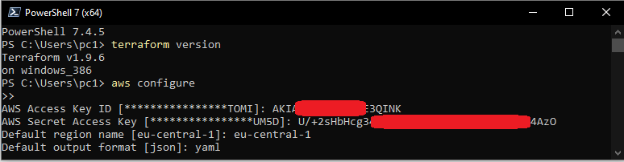
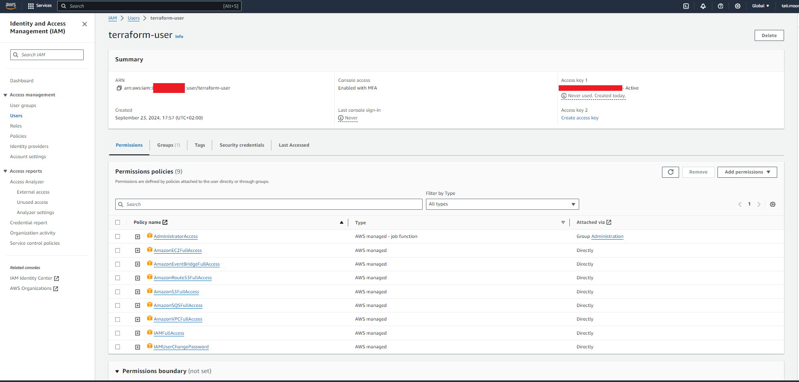
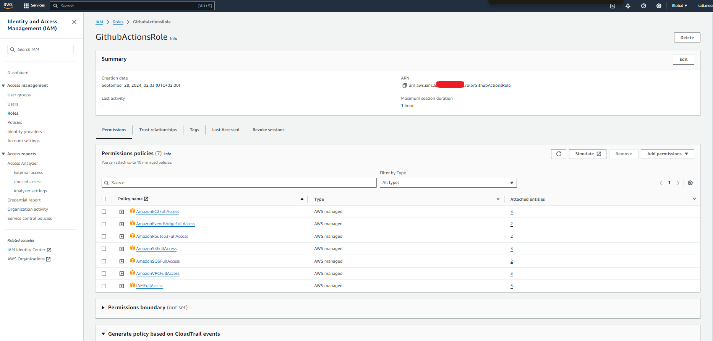
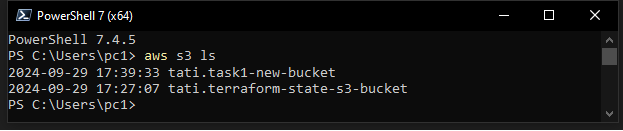
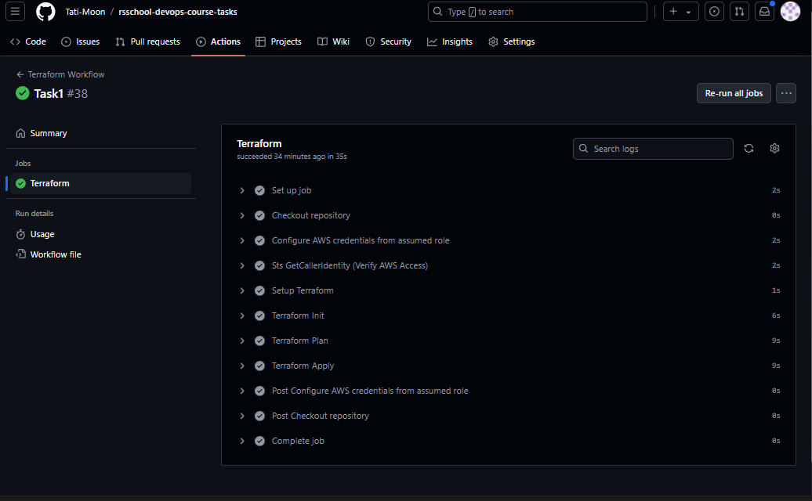

# rsschool-devops-course-tasks

Task 1: AWS Account Configuration
https://github.com/rolling-scopes-school/tasks/blob/master/devops/modules/1_basic-configuration/task_1.md

## Steps

### 1. Installed AWS CLI and Terraform
- Followed the instructions to install **AWS CLI 2**.
- Followed the instructions to install **Terraform 1.6+**.
- **Optional:** Configured Terraform version manager **tfenv**.



### 2. Created IAM User and Configured MFA
- Navigated to IAM in the AWS account and created a new user with the following policies attached:
  - **AmazonEC2FullAccess**
  - **AmazonRoute53FullAccess**
  - **AmazonS3FullAccess**
  - **IAMFullAccess**
  - **AmazonVPCFullAccess**
  - **AmazonSQSFullAccess**
  - **AmazonEventBridgeFullAccess**
- Configured MFA for both the new user and the root user.
- Generated a new pair of **Access Key ID** and **Secret Access Key** for the user.



### 3. Configured AWS CLI
- Configured AWS CLI to use the new user's credentials.
- Verified the configuration by running the command: 
  ```bash
  aws ec2 describe-instance-types --instance-types t4g.nano
  ```
### 4. Created a GitHub Repository for Terraform Code
- Utilized a personal GitHub account to create a repository named **rsschool-devops-course-tasks**. This repository served as the central location for storing and managing the Terraform configuration files.

### 5. Created a Bucket for Terraform States
- Established a dedicated S3 bucket to manage Terraform state files, adhering to best practices for state management. The S3 bucket was configured as the backend for storing the Terraform state, ensuring secure and efficient tracking of infrastructure changes.

### 6. Created an IAM Role for GitHub Actions
- Created an IAM role named **GithubActionsRole**, assigning it the same permissions as the previously created IAM user in step 2. The attached policies included:
  - **AmazonEC2FullAccess**
  - **AmazonRoute53FullAccess**
  - **AmazonS3FullAccess**
  - **IAMFullAccess**
  - **AmazonVPCFullAccess**
  - **AmazonSQSFullAccess**
  - **AmazonEventBridgeFullAccess**
  
  This role enabled GitHub Actions to perform operations on AWS resources securely.

  

### 7. Configured an Identity Provider and Trust Policies for GitHub Actions
- Updated the **GithubActionsRole** IAM role to include a Trust policy that allows GitHub Actions to assume the role. This configuration was based on guidance from:
  - [IAM Roles Terms and Concepts](https://docs.aws.amazon.com/IAM/latest/UserGuide/id_roles_terms.html)
  - [GitHub Tutorial](https://docs.github.com/en/actions/deployment/security-hardening-your-deployments/about-security-hardening-your-deployments)
  - [AWS Documentation on OIDC Providers](https://docs.aws.amazon.com/IAM/latest/UserGuide/id_roles_providers_oidc.html)
  
  (*Note: Replace **GitHubOrg** with the appropriate GitHub username in this context.*)

  

### 8. Created a GitHub Actions Workflow for Deployment via Terraform
- Developed a GitHub Actions workflow to automate the deployment process using Terraform. The workflow comprised three jobs that were triggered on pull requests and pushes to the default branch:
  - **terraform-check**: This job was responsible for format checking the Terraform code using `terraform fmt`.
  - **terraform-plan**: This job executed the `terraform plan` command to outline the changes that would be made to the infrastructure.
  - **terraform-apply**: This job deployed the Terraform configurations using `terraform apply`, applying the changes to the AWS infrastructure.
  
  This workflow streamlined the infrastructure deployment process and ensured consistent application of Terraform configurations.

  